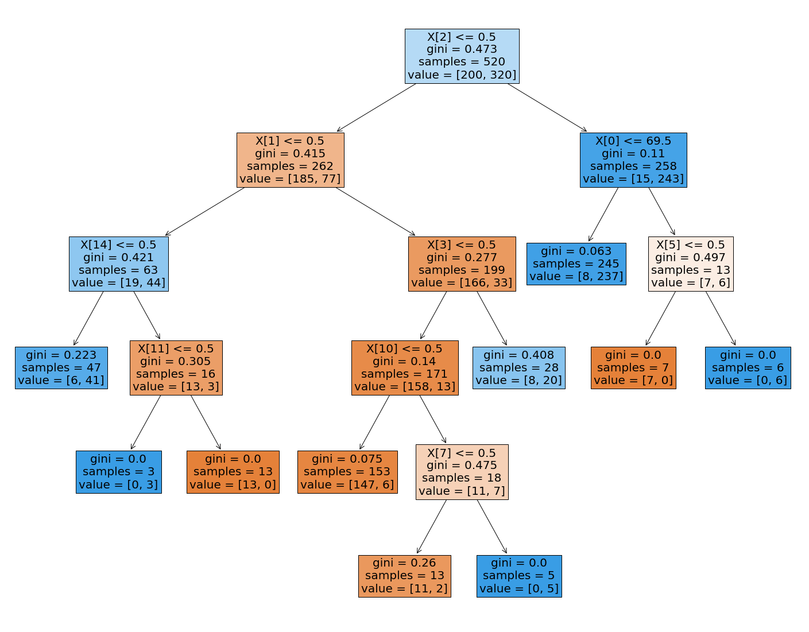
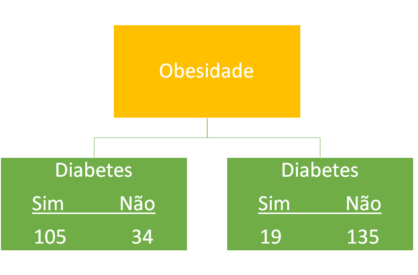

# O que são árvores de decisão?

Uma categoria bem comum de problemas resolvidos em **machine learning** é a de problemas de **classificação**. O e-mail que você recebeu é spam ou não é spam? Qual o animal que você  está vendo em uma foto? O vinho que você está tomando é de boa ou má  qualidade? Todas essas questões são problemas de classificação e podem  ser facilmente resolvidas por seres humanos. Entretanto, o objetivo do  machine learning é automatizar esse tipo de tarefa e para isso  precisamos de algoritmos. 

Uma árvore de decisão é uma ferramenta de representação gráfica  parecida com uma árvore que permite, através de observações de um  conjunto de dados, obter conclusões sobre o que estes dados tentam  prever ou classificar. Por exemplo, imagine o caso onde um pesquisador  em medicina coleta informações de uma série de voluntários, alguns com  diabetes e outros saudáveis. A construção de uma árvore de decisão  permite fazer a classificação dessas pessoas através das informações  coletadas. Uma base desse tipo foi coletada por Islam et al. (2020) e  pode ser acessada neste [link](https://archive.ics.uci.edu/ml/datasets/Early+stage+diabetes+risk+prediction+dataset.).

## Construindo a árvore de decisão

Alguns dos parâmetros coletados consistem na idade, gênero, fraqueza, obesidade entre outros. Como alvo temos classe que significa se a  pessoa testou positivo ou negativo para a diabetes. 

| Idade | Gênero    | Fraqueza | Obesidade | ...  | Classe   |
| ----- | --------- | -------- | --------- | ---- | -------- |
| 40    | Masculino | Sim      | Sim       | ...  | Positivo |
| 58    | Feminino  | Sim      | Não       | ...  | Negativo |
| 41    | Masculino | Não      | Sim       | ...  | Positivo |
| 45    | Feminino  | Sim      | Não       | ...  | Negativo |

Construindo a árvore de decisão para essa base de dados obtemos podemos expressar o resultado em texto:

|--- feature_2 <= 0.50

|   |--- feature_1 <= 0.50

|   |   |--- feature_14 <= 0.50

|   |   |   |--- class: 1

|   |   |--- feature_14 >  0.50

|   |   |   |--- feature_11 <= 0.50

|   |   |   |   |--- class: 1

|   |   |   |--- feature_11 >  0.50

|   |   |   |   |--- class: 0

|   |--- feature_1 >  0.50

|   |   |--- feature_3 <= 0.50

|   |   |   |--- feature_10 <= 0.50

|   |   |   |   |--- class: 0

|   |   |   |--- feature_10 >  0.50

|   |   |   |   |--- feature_7 <= 0.50

|   |   |   |   |   |--- class: 0

|   |   |   |   |--- feature_7 >  0.50

|   |   |   |   |   |--- class: 1

|   |   |--- feature_3 >  0.50

|   |   |   |--- class: 1

|--- feature_2 >  0.50

|   |--- feature_0 <= 69.50

|   |   |--- class: 1

|   |--- feature_0 >  69.50

|   |   |--- feature_5 <= 0.50

|   |   |   |--- class: 0

|   |   |--- feature_5 >  0.50

|   |   |   |--- class: 1

ou através de uma figura.

Cada um dos quadrados recebe o nome de nodo. Dentro de cada nodo  temos um atributo (feature) da nossa base de dados. Por exemplo, o  primeiro nodo mostra que o atributo da coluna 2 divide os 520 elementos  da base de dados em dois grupos com diferentes atributos. Repare que as  classes de cada uma das colunas foram convertidas para o valor 0 ou 1.  Por isso, quando os valores da coluna 2 são menores que 0,5 isso  significa que todos os valores da coluna são iguais a 0. A ramificação  do primeiro nodo para o lado direito levou a um nodo que utiliza a  coluna 0 (Idade) para separar mais os dados. Neste caso, os elementos  abaixo de 69,5 anos de idade podem ser divididos em um nodo final (sem  ramificações) e outro nodo com duas ramificações. No nodo sem  ramificações (folha) devemos observar o parâmetro value (valor). O value mostra quantos elementos da classe 0 ( Negativo) e da classe 1  (Positivo) nós obtemos seguindo este caminho. No resultado ideal as  folhas da árvore irão conter uma certa quantidade de elementos de uma  das classes e nenhum elemento das demais classes. No exemplo acima vemos que isto acontece para algumas folhas, mas não para todas. Isso  significa que precisamos melhorar os parâmetros de entrada na construção da árvore. 

## Critério de divisão

Mas como é feita essa divisão entre grupos. Para a divisão é  utilizado um critério de impureza. O critério mais comumente utilizado é o Gini. 

 Pegando o caso da imagem abaixo onde estamos testando a possibilidade de usar a obesidade como critério de separação.

Para a folha da esquerda o critério Gini pode ser calculado por:

Gini_folha1 = 1 - ( a probabilidade de **Sim**)^2 - ( a probabilidade de **Não**)^2

Substituindo os valores teríamos:

Gini_folha1 = 1 - (105/(105+34))^2 - (34/(105+34))^2 ≅ 0,37

Para a segunda folha teríamos:

Gini_folha2 = 1 - (19/(19+135))^2 - (135/(19+135))^2 ≅ 0,22

Agora repare que a soma do **Sim** e do **Não** é diferente em cada uma das folhas. Na folha da esquerda temos um total de 139 elementos e na da direita temos um total de 154. Por isso, para  calcular o critério Gini total da utilização da obesidade como critério  de separação precisamos calcular a média ponderada dos critérios Gini  das folhas da esquerda e da direita.

Gini_obesidade = (139/(139+154))*0,37 + (154/(139+154))*0,22

Esse cálculo nos leva ao valor de aproximadamente 0,29 para o  critério Gini do parâmetro obesidade. Agora assuma que calculamos  e  obtivemos o critério Gini de 0,27 para o parâmetro fraqueza e de 0,19  para o parâmetro idade. Isso significa que o parâmetro idade é o que  separa melhor os pacientes do que os outros atributos. Assim, esse  atributo é o que ficaria no início da árvore como o parâmetro da segunda coluna da base de dados usada para construir a árvore da primeira  figura. O processo é repetido para os atributos restantes. Repare que o critério Gini é igual a 0 nas folhas onde aconteceu uma separação perfeita.  A performance da classificação através da árvore pode mudar dependendo  da profundidade da árvore e também do número de nodos que permitimos  como ramificação. 

Referências:

Islam, MM Faniqul, et al. 'Likelihood prediction of diabetes at early stage using data mining techniques.' Computer Vision and Machine  Intelligence in Medical Image Analysis. Springer, Singapore, 2020.  113-125.

# Florestas aleatórias

Um problema que encontramos na aplicação de algoritmos de árvores de  decisão é o sobreajuste (overfit). Ou seja, a árvore se ajusta demais  aos dados de treino. Isso é um problema na aplicação de algoritmos de  machine learning porque o objetivo é que o modelo de machine learning  não apenas memorize os dados que usou para aprender sobre o problema. O  ideal é que o modelo seja capaz de generalizar o problema, conseguindo  fazer predições corretas com base em dados que não foram utilizados no  aprendizado.

O algoritmo de floresta aleatória (random forest) é utilizado para  tratar este problema de sobreajuste. Este é um algoritmo de aprendizagem de conjunto. 

## Algoritmos de aprendizagem de conjunto

Algoritmos de aprendizagem de conjunto (ensemble) são algoritmos que  combinam diversos algoritmos de machine learning em um modelo de  predição. O objetivo é diminuir a variabilidade dos resultados, vieses e melhorar as predições. Um algoritmo de aprendizagem em conjunto pode  utilizar qualquer algoritmo de machine learning como a regressão  logística, árvores de decisão e etc. Assim, as predições feitas por cada algoritmo são utilizadas como entrada em um generalizador, o algoritmo  de aprendizagem de conjunto. 

## Como o algoritmo de floresta aleatória trabalha?

O algoritmo de floresta aleatória é um algoritmo de aprendizagem de  conjunto que  utiliza árvores de decisão. Para fazer a previsão, o  algoritmo cria árvores de decisão em amostras dos dados e obtém a  predição de cada uma das árvores. Finalmente o algoritmo seleciona a  melhor solução como sendo a solução de maior ocorrência. No exemplo da  figura abaixo a saída adotada pelo algoritmo seria o diagnóstico de  covid já que este é o que aparece mais vezes. 

![Três árvores de decisão; Duas possuem como saída a classificação positiva para covid e uma a classificação saudável.] - tirar espaço pra ver a imagem.

(https://caelum-online-public.s3.amazonaws.com/bootcamp-transcricao/Imagens/img3.png)

O termo “aleatória” da floresta aleatória surge porque para cada  árvore é passada uma amostra aleatória dos dados de treino. Além disso,  subconjuntos aleatórios de atributos são considerados na hora de dividir os nodos da árvore. Se os nossos dados de treinamento são uma lista  igual [1,2,3,4,5,6], então podemos dar a uma de nossas árvores a lista  [1,2,2,3,6,6] e podemos dar a outra árvore uma lista [2,3,4,4,5,6]. Ou  seja, se estivéssemos trabalhando com dados de covid iríamos passar a  mesma quantidade de pacientes de forma embaralhada. Repare que para  manter o mesmo número de pacientes eventualmente são passados pacientes  repetidos para uma mesma árvore.